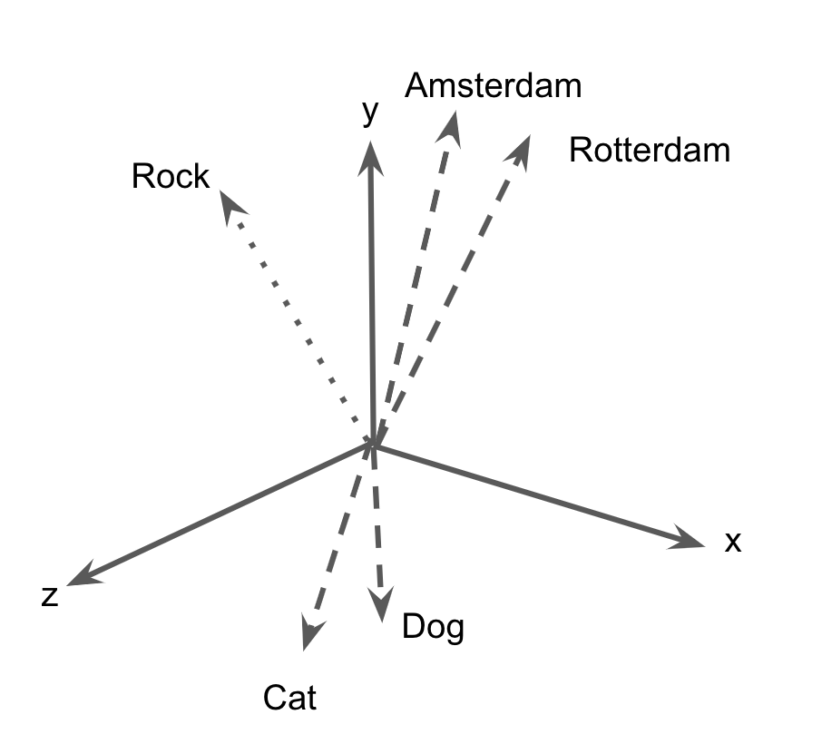
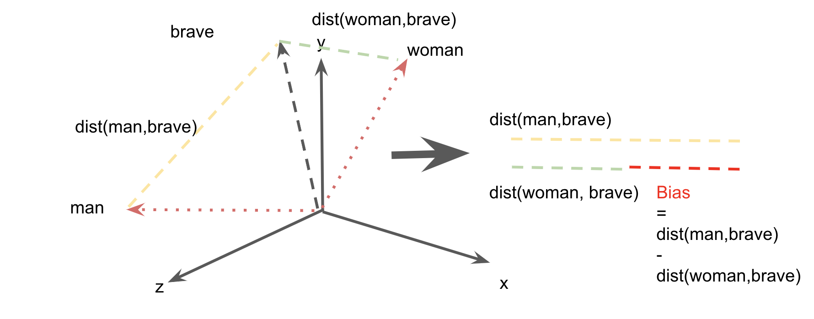

## Introduction: Gender bias in historical newspapers

"Why girls smile and boys don't cry" investigates gender bias in Dutch historical newspapers. It uses computational techniques to detect stereotypes in the portrayal of "men" and "women" during the 19th and 20th century. 

To give one example of such stereotyping, let's inspect a quote from the “Nieuwsblad van het Noorden”, which as many other periodicals aimed at educating their readers by printing moral or philosophical proverbs. On Monday 9 March 1896, it writes “Door zachtheid
regeert de vrouw, door kracht de man (women rule by softness, men by force)."  Such musings on the "proper" gender roles were widespread. As cultural tropes they  appeared frequently, albeit with minor variations: “Eene der schoonste deugden van de vrouw
is zachtheid (softness is a women's most beautiful virtue)” writes the “Rotterdamse Courant” in 1896. Some years later, in 1912, the sentence resonates in Turbantie: “De meest gewenschte eigenschap de vrouw is zachtheid (softness is a women's most desirable characteristic)”. Portraying women as “soft” and men as “powerful” amounts to a blatant form of stereotyping: a process in which traits are selectively attributed to social categories. The number of examples could be extended ad nauseam: a simple query in the Delpher Newspaper database on “vrouw” and “zachtheid” yields more than 12.000 hits.  

While such queries yield useful insights into the attributes accorded to women and men, it remains difficult to quantify (1) the spread of such stereotypes and (2) the strength with which gender categories were associated with particular attributes (e.g. women with "softness" and men with "power"). Traditional historical methods leveraged close reading to answer these question, but such an approach doesn't scale to a corpus the size of the Delpher database. This project, therefore, pursues a computational "distant reading" approach to gender bias in newspapers; it aims to measure the content as well as the circulation of gender stereotypes in Dutch newspapers. 

## Research Context: Bias and Artificial Intelligence

The project ties in with a larger research agenda focussed on bias in artificial intelligence (AI). Give that AI is emerging as a pervasive technology--penetrating many aspects of life, from online shopping, to electoral campaigning--researchers have become increasingly worried of its social and political effects. Specific applications such as facial recognition, have been criticised for discriminating against people of colour. The existing systems work well for recognising faces of socio-economic powerful groups (such as white men) but fail to accurately read those with other [skin tones and facial structure](https://www.ted.com/talks/joy_buolamwini_how_i_m_fighting_bias_in_algorithms?language=en).

The risk here is that AI propagates offline inequalities to the online realm. The same risk applies to the reproduction of social prejudices. AI applications are often based on "Machine Learning", a technique where computers "learn" a certain behaviour from a set of examples (think of the spam filter, which learns to recognise incomings email as spam or not, given a set of examples). Problematically, the materials from which machines learn, are produced by humans, and many papers have recently shown how, in the process of learning, the machines also acquire the biases and prejudices of those who produced the data. 

To explain this in more detail, let's turn to the example of word embeddings models (WEMs), which are a set of algorithms that learn associations between word based on co-occurence in texts. A popular model dating from 2013 is Word2Vec, which basically creates a semantic space (think of a cube as a three dimension vector space, defined by x,y and z axes), and pushes words that tend to co-occur (within a certain context) close to each other, while separating others. I am cutting corners here, for a proper introduction to Word2Vec for Digital Humanities please read this [blog post](http://bookworm.benschmidt.org/posts/2015-10-25-Word-Embeddings.html) of Ben Schmidt.

The baseline here is that Word2Vec  generates an constellation of words in a vector space (i.e. it "embeds" words in a space), which allows researchers to subsequently  compute how similar two words are ("cat" is closer to "dog" than to "stone", as the former share many contexts as opposed to the latter).

Word2Vec has been a power tool for many AI applications (look at Google Scholar's citation count to convince yourself). However, Seminal work by (Bolukbasi et al., 2016) demonstrated that it tends to produce "blatantly sexist" embeddings, in which, for example, women are associated with profession as "nurse" and  "receptionists" and men with "meastro" or "philosopher". 

This finding that generated a stream of articles exploring social bias in word embedding models. While (Bolukbasi et al., 2016) focused on “debiasing” embeddings (as to prevent propagation of the stereotypes to other AI frameworks) other papers leveraged bias a social signal, as a lens on society. (Caliskan et al., 2017) rigorously demonstrated the existence of human-like biases in WEMs, comparing stereotypes derived from WEMs to those obtained from accepted psychological tests (such as the Implicit Association Test). 

## Anticipated Outputs: Bias as Historical Signal

This projects extends these insights to the domain of History, assuming that if word embeddings trained contemporary data replicate contemporary biases, the same applies to the past. 

(Garg et al., 2018) provided a more rigorous validation of this intuition arguing that word embeddings trained on historical data mirror the changing distribution of men and women in the workforce but also capture stereotypical traits. By studying the adjectives associated with Chinese names, the authors have shown that attitudes towards Asian Americans evolved from negative (Chinese being perceived as “barbarous”) to largely positive (Asian Americans as the “model” minority). In other words, word embeddings allow us to monitor bias over time. While we cannot go back to the past, and subject previous generations to psychological tests (to unearth the stereotypes they cherish), the results derived from WEMs closely resemble those that would have been obtained by using a time machine. The figure below  shows (using a fictional example) how we can measure stereotypes by comparing distances between words. In this case we look at the association of "woman" with "brave" and compare this with the distance between "man" and "brave". The difference in these distances (represented as the red line) is the bias. We can repeat this procedure for several decades, and thus measure change over time.

We hereby follow the paper of (Garg et al,. 2018)--and more recently by (Wevers, 2019).But in what way will this research (and the anticipated outputs) improve the current state-of-the art and help other researchs? In general, we hope to contributes to a more fine-grained understanding of gender bias and its circulation in the Netherlands. 

- Firstly, the aim is to create a simple tool that allows researcher to parametrize the training of word embedding, e.g. select articles by year and specific newspaper attributes (such as scope (national or provincial), place of publication, political leaning and/or religious orientation). After selecting the training data, the user can choose between  Word2Vec (2013) or the more recent FastText (2016) algorithm to generate the word embeddings. We intend to experiment with fine-tuning contextual models (such as Bert).  All models trained as part of the research, will be made publicly available. 

- Secondly, we complicate the notion of "men" and "women": existing papers use a relatively small (or particular) set of words to  compute gender bias. They computed how certain attributes (e.g. "kindness")  are associated with a female/male names or explicitly gendered words such as the pronoun "she" . However, for a proper historical inquiry, we intend to first scrutinise the contemporary terminology (which words were used by historical newspaper to describe men and women) and see assess if the bias a applied to all male or female words, or results from particularly strong associations with a certain sub-category (e.g. mothers, or more certain professions).

- Thirdly, besides monitoring the change in bias on a macro-scale (i.e. by decade), we want to understand where the bias actually comes from  (Brunet et al., 2019), i.e. which articles, newspapers, actors or debates increased on decreased the bias? In this sense, our research a fine-grained understanding of the circulation of bias over time and space. 

## References

Bolukbasi, Tolga, Kai-Wei Chang, James Y. Zou, Venkatesh Saligrama, and Adam T. Kalai. "Man is to computer programmer as woman is to homemaker? debiasing word embeddings." In Advances in neural information processing systems, pp. 4349-4357. 2016.

Brunet, Marc-Etienne, Colleen Alkalay-Houlihan, Ashton Anderson, and Richard Zemel. "Understanding the origins of bias in word embeddings." arXiv preprint arXiv:1810.03611 (2018).	

Caliskan, Aylin, Joanna J. Bryson, and Arvind Narayanan. "Semantics derived automatically from language corpora contain human-like biases." Science 356, no. 6334 (2017): 183-186.

Garg, Nikhil, Londa Schiebinger, Dan Jurafsky, and James Zou. "Word embeddings quantify 100 years of gender and ethnic stereotypes." Proceedings of the National Academy of Sciences 115, no. 16 (2018): E3635-E3644.

Wevers, Melvin. "Using Word Embeddings to Examine Gender Bias in Dutch Newspapers, 1950-1990." arXiv preprint arXiv:1907.08922 (2019).

