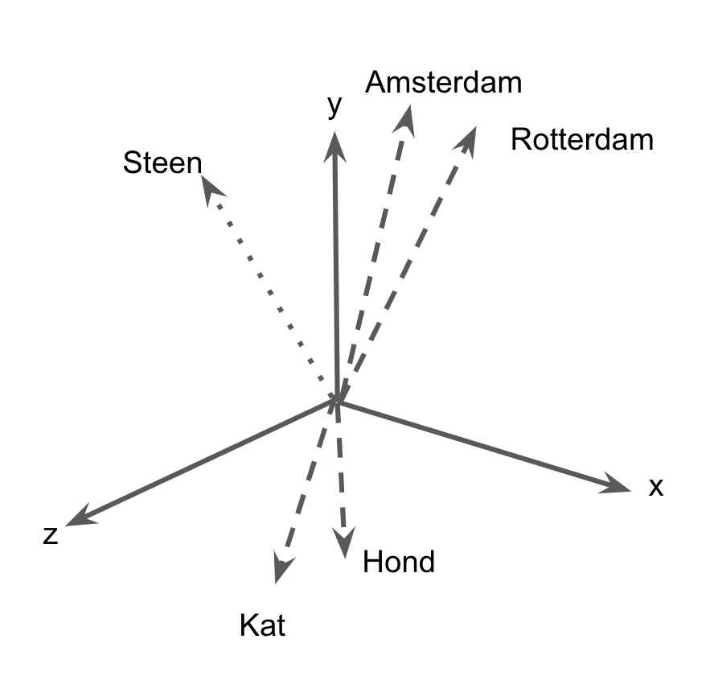
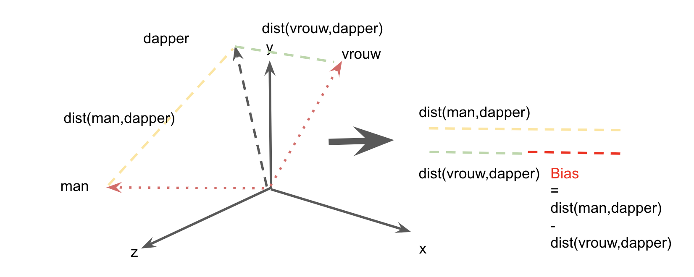

## Inleiding: genderstereotypering in historische kranten

"Waarom meisjes glimlachen en jongens niet huilen" onderzoekt genderstereotypering in Nederlandse historische kranten. Het project maakt gebruik van computationele technieken om de stereotype weergave van "mannen" en "vrouwen" gedurende de 19e en 20e eeuw te analyseren.

Om duidelijk te maken wat we met "stereotypen" of "vooroordelen" bedoelen, laten we een fragment uit het "Nieuwsblad van het Noorden" nader bekijken. Zoals andere kranten, poogde het Nieuwsblad hun lezers te inspireren met moraliserende uitdrukkingen. Op maandag 9 maart 1896 staat er: “Door zachtheid regeert de vrouw, door kracht de man." Dergelijke overpeinzingen over het "correcte" gedrag van vrouwen en mannen waren wijdverbreid en gelijksoortige fragmenten keren dan ook regelmatig terug, zij het met kleine variaties. "Eene der schoonste deugden van de vrouw is zachtheid" schrijft de Rotterdamse Courant in 1896. Enkele jaren later, in 1912, resoneert deze zin in een passage gepubliceerd in Turbantie: "De meest gewenschte eigenschap de vrouw is zachtheid." Vrouwen afbeelden als "zacht" en mannen als "krachtig" is een flagrante vorm van stereotypering: een discursief proces waarbij specifieke eigenschappen selectief aan sociale categorieën worden gehaakt.

Een eenvoudige zoekopdracht in de Delpher krantendatabase naar artikels die zowel "vrouw" als "zachtheid" bevatten, levert meer dan 12.000 hits op—-en suggereert dus dat zulke ideeën grotendeels gemeengoed waren, zeker tot aan het midden van de twintigste eeuw. Hoewel dergelijke zoekopdrachten nuttige inzichten opleveren, blijft het moeilijk om (1) de verspreiding van dergelijke stereotypen te kwantificeren en (2) de intensiteit te meten waarmee gender-categorieën worden geassocieerd met bepaalde attributen (bijv. vrouwen met "zachtheid" en mannen met "kracht"). Traditionele historische methoden maken gebruik van _close reading_ om deze vraag te beantwoorden, maar een dergelijke benadering schaalt niet naar een corpus zo groot als de Delpher database. Dit project gebruikt daarom _distant reading_ om gendervooroordelen op een “macro” schaal in kaart te brengen; het beoogt zowel de inhoud als de verspreiding van genderstereotypen in Nederlandse kranten te meten.

## Onderzoekscontext: _bias_ en kunstmatige intelligentie

De ambities van dit project sluiten aan bij een bredere onderzoeksagenda die zich toelegt op de rol van _bias_ in kunstmatige intelligentie (KI). KI is snel opkomende technologie, die vele aspecten van het leven doordringt--van online winkelen tot verkiezingscampagnes. Onderzoekers maken zich daarom steeds meer zorgen over de sociale en politieke effecten van zulke innovaties. Specifieke toepassingen, zoals gezichtsherkenning bijvoorbeeld, zijn veelvuldig bekritiseerd omdat ze mensen van kleur discrimineren: de bestaande systemen werken goed voor het herkennen van gezichten van sociaal-economische machtige groepen (zoals blanke mannen) maar kunnen niet zo goed overweg met mensen met andere [huidtinten en gelaatsstructuur](https://www.ted.com/talks/joy_buolamwini_how_i_m_fighting_bias_in_algorithms?language=en).

Het risico bestaat dus dat KI de ongelijkheden die de “offline” wereld beheersen, ook “online” repliceert. Hetzelfde geldt voor de reproductie van sociale vooroordelen. KI-applicaties zijn vaak gebaseerd op "Machine Learning", een techniek waarbij computers een bepaald gedrag "leren" aan de hand van een aantal voorbeelden (denk aan de spamfilter, waar een algoritme leert om inkomende e-mails als spam of niet-spam te herkennen, op basis van een aantal voorbeelden) . Een computer neemt een voorbeeld aan menselijk gedrag (en oordelen) en poogt deze zo nauwkeurig mogelijk te repliceren. 

Problematisch is dat algoritmes daarbij ook de menselijke vooroordelen kunnen overnemen, zoals enkele artikels recent hebben aangetoond. Om dit concreet te maken, laten we het voorbeeld van _word embedding models_ (WEMs) nader bekijken. WEMs zijn een verzameling algoritmen die associaties leren tussen woorden op basis van hun gemeenschappelijk voorkomen (_co-occurence_) in een corpus. Een populair model met de naam _Word2Vec_ stamt uit 2013. Het algoritme creëert een semantische ruimte (denk aan een driedimensionale vectorruimte, gedefinieerd door x-, y- en z-assen, zie figuur 1), en duwt woorden die vaak voorkomen (binnen een bepaalde context) dicht bij elkaar, terwijl het andere woorden verder weg schuift. (Ik maakt hier grote stappen, voor een degelijke introductie tot Word2Vec voor Digital Humanities lees deze [blogpost](http://bookworm.benschmidt.org/posts/2015-10-25-Word-Embeddings.html) van Ben Schmidt.

Word2Vec genereert zo een ordening van woorden in een vectorruimte (dat wil zeggen dat het woorden “embed" in een vectorruimte), op basis waarvan onderzoekers vervolgens kunnen berekenen hoe “dichtbij” (en dus semantisch gelijkend) twee woorden zijn. In figuur 1 is  "Kat" dichter bij "Hond" dan bij "Steen", aangezien de eerste twee woorden veel tekstuele contexten delen in tegenstelling tot de laatste.

Word2Vec is een krachtige tool voor veel KI-toepassingen (kijk bijvoorbeeld naar de citatielijst op Google Scholar om jezelf te overtuigen). Maar met de populariteit kwam ook kritiek: een artikel van (Bolukbasi et al., 2016) toonde aan dat Word2Vec de neiging heeft om "onversneden seksistische" ("blatantly sexist") stereotypen over te nemen. In een _embedding_ getraint op nieuwsberichten (en hopelijk neutralere bron), wordt "vrouw" geassocieerd met beroepen als "verpleegkundige" en "receptionist" terwijl "man" met "meastro" of "filosoof" in verband wordt gebracht. Word2Vec "leert" dus wat woorden betekenen aan de hand van mijn menselijk taalgebruik, maar neemt hierbij ook de menselijke vooroordelen stereotypen over.

Op deze bevinding volgde een stroom artikelen die sociale biases in modellen onderzochten. Waar (Bolukbasi et al., 2016) zich concentreerden op het '_debiasing_' van de WEMs (het verwijderen van de _bias_ om verspreiding van de stereotypen naar andere KI-applicaties te voorkomen), gebruikten andere artikelen deze bias een “signaal”: als een lens om de maatschappij bestuderen.  (Caliskan et al., 2017) demonstreerden rigoureus hoe menselijke vooroordelen terugkeren in associaties geleerd door WEMs. Zij vergeleken stereotypen afgeleid uit geaccepteerde psychologische tests (zoals de Implicit Association Test) met associaties tussen woorden in een _embedding_.

## Verwachte uitkomsten: bias als historisch signaal

Dit project past deze technieken toe om de geschiedenis van gender te bestuderen: ervan uitgaande dat als WEMs getraind op hedendaagse gegevens hedendaagse vooroordelen oppikken, hetzelfde ook moet gelden voor het verleden.

(Garg et al., 2018) hebben deze intuïtie echter rigoreus gevalideerd: zij demonstreerden hoe WEMs de veranderende verdeling van mannen en vrouwen in de arbeidsmarkt weerspiegelen. Maar ook hoe deze algoritmes historische stereotypen over minderheden oppikken. Door bijvoeglijke naamwoorden geassocieerd met Aziatische namen te bestuderen, hebben de auteurs aangetoond dat de houding ten opzichte van Aziatische-Amerikanen evolueerde van algemeen negatief beeld (Chinees wordt gezien als "barbaars") naar positief stereotypering (Aziatische Amerikanen als de "model" minderheid). Met andere woorden, WEMs stellen ons in staat om verandering in de tijd te volgen. Hoewel we niet terug kunnen gaan naar het verleden—en inmiddels vergane generaties kunnen onderwerpen aan psychologische tests (om de stereotypen die ze koesteren te achterhalen)--lijken de resultaten verkregen met WEM's sterk op die verkregen met behulp van een tijdmachine. De figuur hieronder toont (aan de hand van een fictief voorbeeld) hoe we door de afstanden van woorden te vergelijken, iets kunnen zeggen over stereotypes. In dit geval kijken we naar de associatie van "vrouw" met "dapper", en vergelijken deze met afstand tussen "man" en "dapper". Het verschil in deze afstanden (verbeeldt als de rode lijn) is de _bias_. We kunnen deze procedure voor verschillende decennia herhalen, en zo verandering over de tijd meten.

Deze aanpak volgt het voorbeeld van (Garg et al., 2018)--en meer recentelijk (Wevers, 2019). Beide gebruiken historische kranten om de gendervooroordelen van de afgelopen generaties te onderzoeken. Maar hoe zal dit onderzoek (en de verwachte resultaten) de state-of-the-art verbeteren en andere onderzoekers helpen? Over het algemeen hopen we bij te dragen tot een meer verfijnd begrip van gendervooroordeel en de verspreiding ervan in Nederland.

- Ten eerste willen we een eenvoudig hulpmiddel leveren waarmee onderzoekers zelf het trainen van word embeddings kunnen parametriseren, door bijvoorbeeld artikelen te selecteren per jaar en specifieke krantenattributen (zoals bereik (nationaal of provinciaal), plaats van publicatie, politieke voorkeur en/of religieuze oriëntatie). Na het selecteren van deze artikelen, kan de gebruiker kiezen tussen Word2Vec (2013) of het recentere FastText algoritme (2016) om embeddigns te genereren. We zijn ook van plan te experimenteren met het verfijnen van contextuele modellen (zoals BERT). Alle modellen die zijn getraind als onderdeel van het onderzoek, zullen worden openbaar gemaakt.

- Ten tweede pogen we het simpele onderscheid tussen "mannen" en "vrouwen" te problematiseren: voorgaand onderzoek hanteerde een relatief kleine (of specifieke) verzameling woorden om gendervooroordelen in kaart te brengen. Ze berekenden hoe bepaalde attributen (bijv. "vriendelijkheid") worden geassocieerd met een vrouwelijke/mannelijke namen of woorden met een expliciet gender, zoals "moeder". Voor een degelijk historisch onderzoek, zijn we van plan eerst de eigentijdse terminologie (welke woorden door de historische krant werden gebruikt om mannen en vrouwen te beschrijven) onder de loep te nemen. Op basis hiervan kijken we of de _bias_ van toepassing is op alle “mannelijke” of “vrouwelijke” woorden, of dat voortvloeit uit sterke associaties met bepaalde subcategorieën (bijvoorbeeld ”moeder” of bepaalde beroepen).

- Ten derde willen we, naast het monitoren van bias op macroschaal (dat wil zeggen per decennium) ook begrijpen waar de bias eigenlijk vandaan komt (Brunet et al., 2019): welke artikelen, kranten, acteurs of debatten zijn verantwoordelijk voor een toegenomen op afgezwakte stereotypering? 

## References

Bolukbasi, Tolga, Kai-Wei Chang, James Y. Zou, Venkatesh Saligrama, and Adam T. Kalai. "Man is to computer programmer as woman is to homemaker? debiasing word embeddings." In Advances in neural information processing systems, pp. 4349-4357. 2016.

Brunet, Marc-Etienne, Colleen Alkalay-Houlihan, Ashton Anderson, and Richard Zemel. "Understanding the origins of bias in word embeddings." arXiv preprint arXiv:1810.03611 (2018).	

Caliskan, Aylin, Joanna J. Bryson, and Arvind Narayanan. "Semantics derived automatically from language corpora contain human-like biases." Science 356, no. 6334 (2017): 183-186.

Garg, Nikhil, Londa Schiebinger, Dan Jurafsky, and James Zou. "Word embeddings quantify 100 years of gender and ethnic stereotypes." Proceedings of the National Academy of Sciences 115, no. 16 (2018): E3635-E3644.

Wevers, Melvin. "Using Word Embeddings to Examine Gender Bias in Dutch Newspapers, 1950-1990." arXiv preprint arXiv:1907.08922 (2019).

