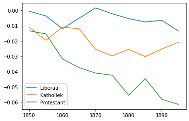
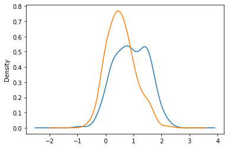

## Exploring bias in word embeddings

The [Notebook](./Explore_bias.ipynb) gives an overview of all function for analysing bias in word embedding trained on the Delpher newspapers. The README gives a very concise overview of the Notebook functionality.

## Loading models

The `select_model_by_facet_value` loads all models for a specific facet value, e.g. all `catholic` or `liberal` models

```python
katholiek_models = select_model_by_facet_value('Katholiek',root=root)
```

## Plotting timelines

You can inspect how bias changes over time, comparing the evolution for different facets





## Inspecting bias scores

Besides these timelines, you can zoom in on a specific year, and inspect the words that drive these differences, by either plotting the distribution of bias scores by facet and category (i.e. the distribution of scores for female words in a liberal model) and rank words by their bias scores (i.e. get the most biased male words in a catholic model.

### Plot distribution 




### Rank words
```python
sorted(lib_bias[0].items(),key=lambda x: x[1],reverse=True)[:10]
```

```python
[('brunette', 2.297665663063526),
 ('kunstenares', 2.171439327299595),
 ('kamenier', 2.1621857807040215),
 ('buurvrouw', 2.060928963124752),
 ('somnambule', 2.010161869227886),
 ('gezellin', 1.9951301217079163),
 ('dienstmaagd', 1.980964258313179),
 ('dame', 1.9173139687627554),
 ('slavin', 1.8965954706072807),
 ('martelares', 1.8692283928394318)]
```