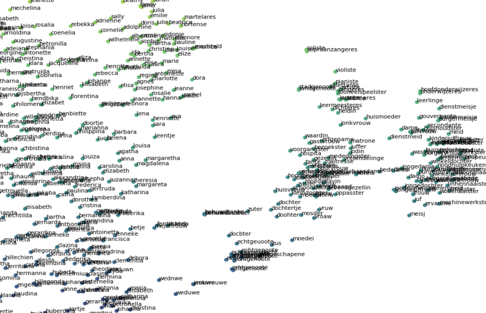

# Lexicon Expansion Instruction

The Lexicon Expansion code allows you to create word list by systematically navigating embedding spaces. It provides functions to explore vector spaces and create word lists that track some kind of underlying concepts.

All code is available via the `LexiconExpansion.ipynb` Make sure that you have installed `ipyannotate` before annotation.

Lexicon Expansion contains three different methods for navigating word embeddings, which are explained in more detail below.

- [Unidirectional Expansion](#unidirectional-expansion)
- [Contrastive Expansion](#contrastive-expansion)
- [Expansion with Active Learning](#expansion-with-active-learning)

Please consult the notebook for more information and instruction. The README only gives a consice overview of the expansion procedure and results.

## Unidirectional Expansion

This method allows you to explore the region around a set of selected seed word. For example, in the notebook we selected the words "vrouw" (woman) and "moeder" (mother) to start querying for female words in the vector space.

```python
core = {'vrouw','moeder'} # select seed words
core_init = average_vector(core.copy(),model) # average the vector representation of the selected seed words
```

After specifying the seed words, you need to select a **sampling strategy** which defines how we will navigate the vector space. Here we use the simple `average` procedure, which simply looks at the words currently in the lexicon `L`, and explores the area surroundig `avg(v(L))` the avarage of the vector representation of the word in `L`.

```python
sampling_procedure = sampling_options['average']
```

The expansion consists of several iteration of annotations, updating the query vector, and inspecting the results. The process is exemplified by the screencast below. 

### Screencast of unidirectional expansion


The different steps are:
- Select seed words (1.1): in this case we chose "vrouw" and "vrouwen" as the seed query
- Select Sampling strategy (1.2.1): : `"average"` selects the simplest method which samples the closest neighbours to the query vector, other option are `"query_tokens"`, `"entropy"` and `"distance"`.
- Annotate (1.2.2): `Core` words will be added to lexicon and influence constructing the query vector. `Peripheral` words will be saved but don't influence the sampling. In this scenario I added unambiguously "female" words to the `Core` lexicon and OCR variants to the `Peripheral` word list. These words are saved, in case they are need later. I ignored For all other words (`Ignore`)
- Update lexicon with annotations (1.2.3): the next code blocks, updated the lexicon with the annotations. You can now go back to the 1.2.2 to harvest more words (but don't forget to save afterwards!) or you can plot the results.
- Plot the lexicon and surround words (1.3): the visualisation plots all the selected words on a 2D plane. The re
- Save lexicon (1.4): save the results of the annotation process for later use.

The expansion normally consists of multiple iterations. The figure below plots the of multiple annotation rounds that aimed to harvest different words referring to women in newspapers.



## Contrastive Expansion

Where unidirection expansion explores a specific area of a vector space, the contrastive expansion allows you investigate a (laten) dimension. This can be useful to seperate separate antynyms from synonyms, when creating an emotion dictionary. Or find words that are most similar to female words **and** most dissimilar to male words. 

The procedure is largely the same, with some small exceptions.

```python
core = {'vrouw','vrouwen'}
antipode = {'man','mannen'}
```

Instead of one seed word list, you have to define two, each of them representing opposite "ends" of the dimension you want to explore. In our case, because we were interested feminity and masculinity in newspapers, we simply select "woman" and "man" as seed words representing the opposite point of the dimension we want to investigate.

Selection of seed words are followed by two annotation rounds, one that explores words closest to the `Core` end of the spectrum, and the opposite, most `Antipode` words.

The annotation options are similar to the unidirectional expansio, with exception of the `Antipode` button, which assign words to the `Antipode` lexicon.

### Screencast of contrastive expansion


## Expansion with Active Learning

Coming soon.